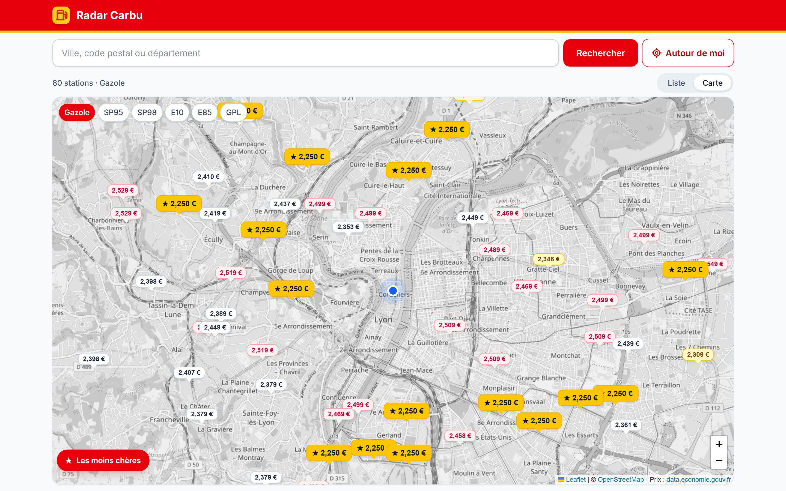
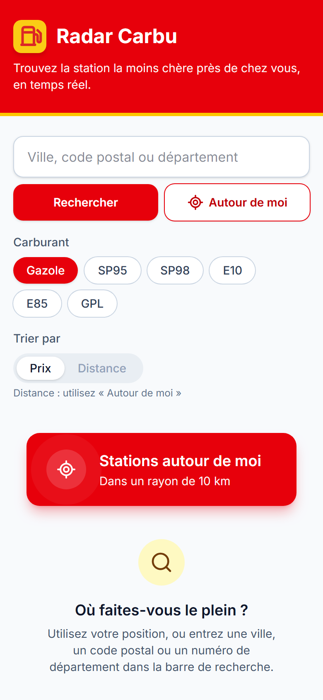
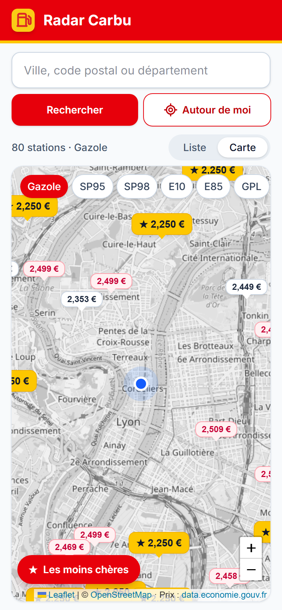
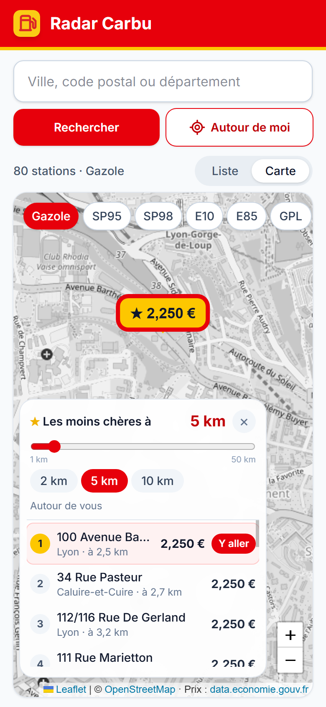

<div align="center">


# Radar Carbu

**Trouvez la station la moins chère autour de vous, en temps réel.**

Application web qui compare les prix des carburants en France à partir des données ouvertes du gouvernement.

[**Voir la démo →**](https://radarcarbu.vercel.app)


</div>



<p align="center">
  
  &nbsp;
  
  &nbsp;
  
</p>

## Fonctionnalités

- **Recherche par ville, code postal ou département**, ou **autour de soi** grâce à la géolocalisation.
- **Filtre par carburant** : Gazole, SP95, SP98, E10, E85, GPL. Le choix est mémorisé entre deux visites.
- **Vue liste ou carte** :
  - la liste se trie **par prix ou par distance** ;
  - sur la carte, chaque station affiche son prix dans une épingle colorée, du **jaune** (les moins chères) au **rose** (les plus chères).
- **« Les moins chères à X km »** : un curseur de 1 à 50 km liste les 20 stations les moins chères du rayon. Un clic sur une station centre la carte dessus.
- **Itinéraire** vers chaque station en un clic (Google Maps).
- **États soignés** : chargement (squelettes), erreur réseau avec « Réessayer », aucun résultat, géolocalisation refusée.
- **Mobile first** : en vue carte, l'application tient exactement dans l'écran du téléphone, sans défilement.

## Stack technique

| Outil | Rôle |
|---|---|
| [React 19](https://react.dev) | Interface en composants, hooks personnalisés |
| [Vite](https://vite.dev) | Serveur de développement et build de production |
| [Tailwind CSS v4](https://tailwindcss.com) | Styles utilitaires, thème de couleurs personnalisé |
| [Leaflet](https://leafletjs.com) + [React Leaflet](https://react-leaflet.js.org) | Carte interactive (tuiles [OpenStreetMap](https://www.openstreetmap.org)) |
| [API data.economie.gouv.fr](https://data.economie.gouv.fr/explore/dataset/prix-des-carburants-en-france-flux-instantane-v2/) | Prix des carburants en temps réel (open data, sans clé) |
| [Oxlint](https://oxc.rs) | Analyse statique du code |

Aucune bibliothèque de gestion d'état ni de requêtes : `useState`, `useEffect`, `useMemo` et `fetch` suffisent à la taille du projet.

## Points techniques

- **Filtrage côté serveur.** Les recherches sont traduites en requêtes ODSQL (`within_distance`, `like`, `order_by`) : l'application ne télécharge que les stations utiles, jamais les 10 000 de France.
- **Debounce et annulation de requêtes.** Le curseur de distance n'interroge l'API qu'une fois l'utilisateur arrêté (400 ms), et annule la requête précédente avec `AbortController` pour éviter les *race conditions*.
- **Chargement à la demande.** Leaflet (≈ 155 Ko) est isolé dans un fichier séparé grâce à `React.lazy` et n'est téléchargé que lorsque la carte s'affiche.
- **Logique séparée de l'affichage.** Appels réseau dans `api/`, état et effets dans des hooks (`useStations`, `useCheapestNearby`…), calculs dans des fonctions pures (`utils/`), testables sans navigateur.
- **Design tokens.** Les couleurs de la marque sont déclarées une seule fois dans le thème Tailwind (`brand`, `accent`).
- **Accessibilité.** Labels de formulaire, rôles ARIA (`alert`, `status`), navigation au clavier, et respect de `prefers-reduced-motion`.

## Structure du projet

```
src/
├── api/
│   └── fuelApi.js          # Appels à l'API et mise en forme des données
├── hooks/
│   ├── useStations.js      # Recherche des stations (chargement, erreurs, géolocalisation)
│   ├── useCheapestNearby.js# Les moins chères dans un rayon (debounce + annulation)
│   └── useSelectedFuel.js  # Carburant choisi, mémorisé dans le localStorage
├── components/             # Composants d'interface (SearchBar, StationCard, StationMap…)
├── utils/                  # Fonctions pures : distance, tri, formatage, géolocalisation
├── App.jsx                 # État principal et mise en page (liste ou carte)
├── index.css               # Import de Tailwind et thème (couleurs, animation)
└── main.jsx                # Point d'entrée
```

## Installation

Prérequis : [Node.js](https://nodejs.org) 20.19 ou plus récent.

```bash
git clone https://github.com/mehdipares/ComparateurCarburant.git
cd ComparateurCarburant
npm install
npm run dev
```

L'application est disponible sur [http://localhost:5173](http://localhost:5173). Aucune clé d'API ni variable d'environnement n'est nécessaire.

| Commande | Description |
|---|---|
| `npm run dev` | Lance le serveur de développement |
| `npm run build` | Construit la version de production dans `dist/` |
| `npm run preview` | Sert localement la version de production |
| `npm run lint` | Analyse le code avec Oxlint |

## Déploiement

Le projet est déployé sur [Vercel](https://vercel.com), qui détecte automatiquement Vite : chaque `git push` sur `main` met le site à jour.

## Données

Prix issus du jeu de données [« Prix des carburants en France – Flux instantané »](https://data.economie.gouv.fr/explore/dataset/prix-des-carburants-en-france-flux-instantane-v2/) du ministère de l'Économie, publié sous [Licence Ouverte Etalab 2.0](https://www.etalab.gouv.fr/licence-ouverte-open-licence/). Fonds de carte © contributeurs [OpenStreetMap](https://www.openstreetmap.org/copyright).

## Auteur

Projet réalisé par [@mehdipares](https://github.com/mehdipares) dans le cadre d'une formation en développement web.
